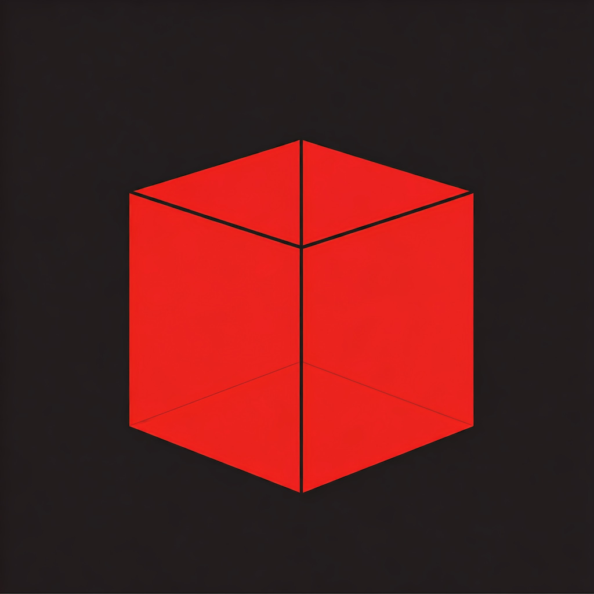
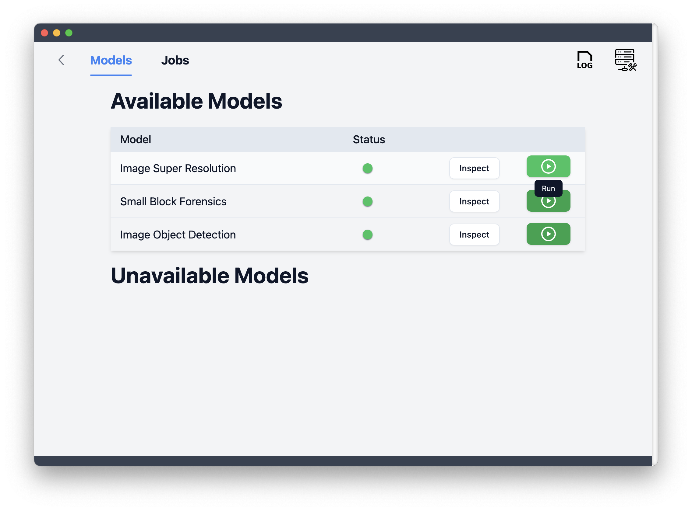
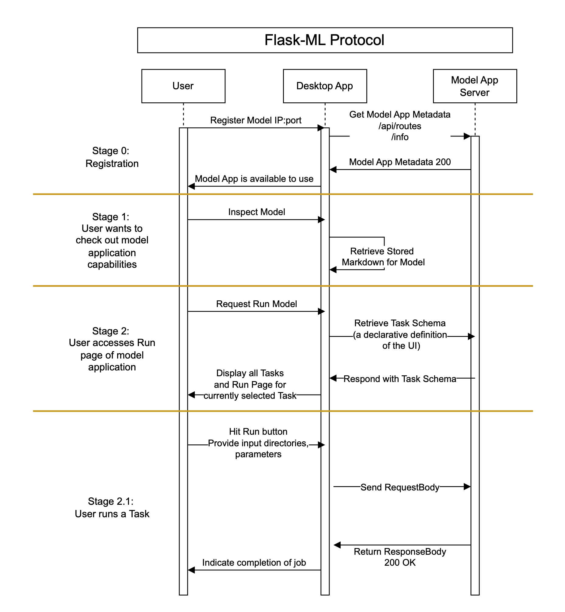

[![Build Status][github-actions-status]][github-actions-url]
[![Github Tag][github-tag-image]][github-tag-url]

# RescueBox Desktop



RescueBox Desktop (RBox) is a self-contained binary offering a UI interface to a library of ML models for various forensic applications. As long as model applications are running in the background adhering to the [FlaskML](https://umass-rescue.github.io/Flask-ML/materials/guides/examples) interface. Users first register the model application's IP Host address and port, then specify its inputs on the UI and analyze outputs when ready. RBox handles the rest: running the jobs, and interfacing with different ML models. Since RBox is aimed toward forensic analysts, it is designed to operate on local, or drive-mounted, storage.

For a review of the project's goals, read [What is RescueBox Desktop?](./docs/what-is-rescuebox-desktop.md). For a view into how RBox-Desktop works, read the [architecture section](#architecture)

# Getting Started

## Step 1: Download the Latest Release

Get the latest release of the binary for your operating system (Windows, macOS and Linux) from the [release page](https://github.com/UMass-Rescue/RescueBox-Desktop/releases)

## Step 2: Start a Flask-ML Compliant Model

Download and install one of the [Flask-ML compliant models](https://umass-rescue.github.io/Flask-ML/materials/guides/examples), or [write your own!](https://umass-rescue.github.io/Flask-ML/materials/guides/getting-started)

Run the model application, which should provide you with a URL to register with RBox.

## Step 3: Using the App

Launch the binary you downloaded in [step 1](#step-1-download-the-latest-release), and register the model application using the IP address and port.

You should now be able to see the model application in the app, and be able to run inference tasks on it!



# Development

RescueBox Desktop is built using [Electron](https://www.electronjs.org/), [React](https://reactjs.org/), TypeScript, TailwindCSS, and SQlite (with Sequelize). The app is built using [Electron-React](https://electron-react-boilerplate.js.org/) boilerplate.

RescueBox implments the "Flask-ML" protocol, which is a simple interface for running ML models. See [Flask-ML Protocol](./docs/FlaskML-Protocol-Sequence-Diagram.png).



# Development

## Install

Clone the repo and install dependencies:

```bash
git clone https://github.com/UMass-Rescue/RescueBox-Desktop.git
cd RescueBox-Desktop
npm install
```

**Having issues installing? See this [debugging guide](https://github.com/electron-react-boilerplate/electron-react-boilerplate/issues/400)**

## Starting Development

Start the app in the `dev` environment:

```bash
npm start
```

## Packaging for Production

To package apps for the local platform:

```bash
npm run package
```

## Docs

See electron-react's [docs and guides here](https://electron-react-boilerplate.js.org/docs/installation)

[github-actions-status]: https://github.com/UMass-Rescue/RescueBox-Desktop/actions/workflows/test.yml/badge.svg?branch=main
[github-actions-url]: https://github.com/UMass-Rescue/RescueBox-Desktop/actions/workflows/test.yml
[github-tag-image]: https://img.shields.io/github/tag/UMass-Rescue/RescueBox-Desktop.svg?label=version
[github-tag-url]: https://github.com/UMass-Rescue/RescueBox-Desktop/releases/latest
