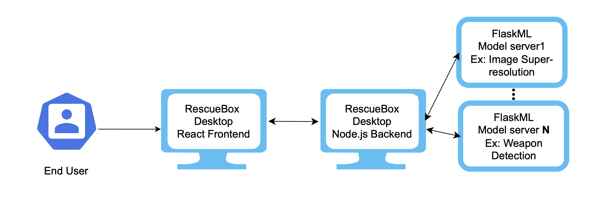

[![Build Status][github-actions-status]][github-actions-url]

# RescueBox Desktop


RescueBox Desktop (RBox) aims to be a self-contained binary offering a library of ML models for various forensic application. Users simply specify the model they want to run (selected from a list of available models), specify its inputs and analyze outputs when ready. RBox handles the rest: running the jobs, and interfacing with different ML models. As of v0.1.0, the models need to be running in the background adhering to the FlaskML interface.

For a review of the project's goals, read [What is RescueBox Desktop?](./docs/what-is-rescuebox-desktop.md)

# Roadmap

Read [Roadmap for v0.1.0](./docs/roadmap-v0.1.0.md) for a look into the project's goals for the v0.1.0 release



The basic components and their responsibilities are:

- End User:
  1) Run the flask-ml servers for the desired models
  2) Run our frontend application to easily interact with the model, which includes: inserting inputs, sending requests, viewing outputs

- Electron-React Frontend
  1) Model page: Viewing available models & registering new model through its ip address
  2) Specific Model app pages: Viewing model details & running the model (collecting inputs - form)
  3) Jobs page: Viewing Active/Past Jobs, cancel button for running jobs. Job details page & outputs tab for each job

- Electron-Node.js Backend
  1) Data Persistence: Tables to store jobs, models and model registration and creating an API using some ORM to access data easily.
  2) Handle model server registration: storing IP addresses and polling server to check if it's running
  3) Jobs: exposing a standard API to start jobs which would then interact with the flask ml servers as needed
  4) Outputs: Standard API to access job metadata
  5) CI: github actions to build executables for all 3 OSes
  6) Logging: standard logging

- Flask-ml-model apps
  1) Provide standard API exposing the model's functionality.

# Development

## Install

Clone the repo and install dependencies:

```bash
git clone https://github.com/UMass-Rescue/RescueBox-Desktop.git
cd RescueBox-Desktop
npm install
```

**Having issues installing? See this [debugging guide](https://github.com/electron-react-boilerplate/electron-react-boilerplate/issues/400)**

## Starting Development

Start the app in the `dev` environment:

```bash
npm start
```

## Packaging for Production

To package apps for the local platform:

```bash
npm run package
```

## Docs

See electron-react's [docs and guides here](https://electron-react-boilerplate.js.org/docs/installation)

[github-actions-status]: https://github.com/UMass-Rescue/RescueBox-Desktop/actions/workflows/test.yml/badge.svg?branch=main
[github-actions-url]: https://github.com/UMass-Rescue/RescueBox-Desktop/actions/workflows/test.yml
