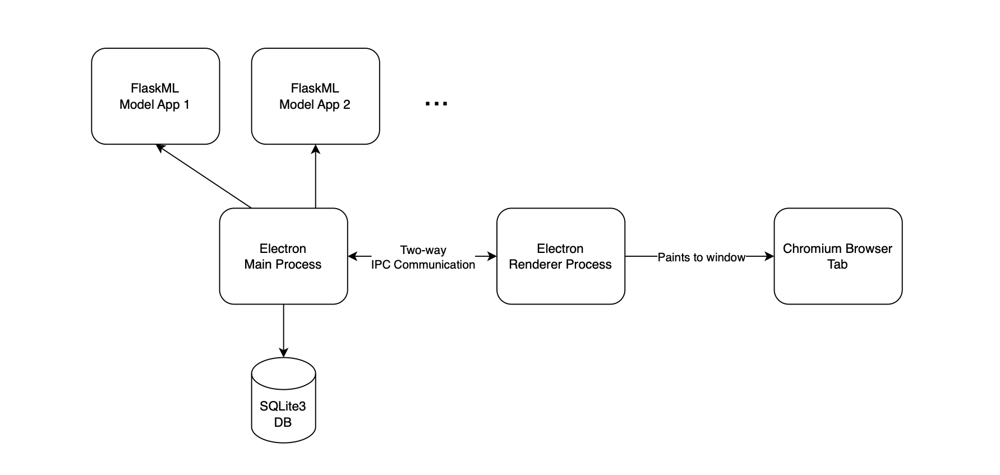

# Code Components

## Electron

- [Electron](https://electronjs.org/)
- [Electron-React](https://github.com/electron-react-boilerplate/electron-react-boilerplate)

## SQLite3 Database

- The database path for development is printed in the logs

### Migrations

- What are migrations? Migrations help transition database schemas from their current state to a new desired state, whether that involves adding tables and columns, removing elements, splitting fields, or changing types and constraints. (see [sequelize.org](https://sequelize.org/docs/v6/other-topics/migrations/) for a definition)
- They are used so that the database schema can evolve over time and be easily updated when a user upgrades the application
- The migrations are stored in the `src/main/database/migrations` folder
- The migrations are executed in the order they are listed in the `src/main/database/migrations/umzug.ts` file
- https://sequelize.org/docs/v6/

## Openapi 

The "Flask-ML" protocol is specified by an openapi.yaml schema shared by this project and Flask-ML.

- Flask-ML: https://github.com/UMass-Rescue/Flask-ML/blob/31c35a9dfc4c062eb6fcfa6c560aea8bb1eb3f88/src/flask_ml/flask_ml_server/openapi.yaml
- The purpose of this file is to define common objects and operations
- Any changes made to this file must be shared in the other project
- This file autogenerates code
  - In this project, code is autogenerated using `npm run build:models` (see package.json)
  - In Flask-ML, code is autogenerated using `make generate-models` (see Makefile)
- This helps a ton in safe refactoring because making breaking changes will make compile time errors in both projects, and thus helps in compiler-assisted refactoring
